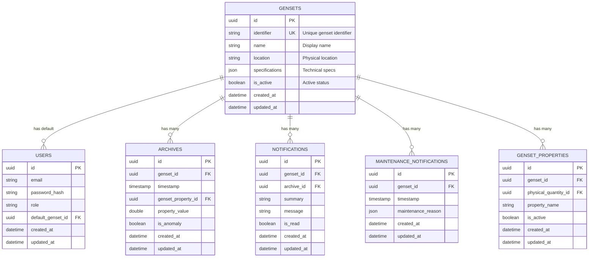

# Design Document

## Overview

The multiple-genset workflow feature transforms the current single-genset monitoring system into a multi-genset architecture with a futuristic selection interface. The design introduces a new `Genset` entity as the primary organizational unit, with all existing data models extended to include genset associations. 

The frontend features a fullscreen genset selection interface with smooth motion animations, intuitive genset switching, and complete data isolation. The backend implements genset-aware services with proper data filtering and real-time streaming capabilities.

## Architecture

### Database Schema Changes

The core architectural change involves introducing a `gensets` table and adding genset foreign key relationships to all relevant existing tables:



### Backend Architecture

The backend follows a layered approach with genset-aware services:

#### 1. Model Layer
All data models extended with genset relationships and proper foreign key constraints.

#### 2. Service Layer
Genset-scoped business logic with automatic data filtering:
- **GensetService**: CRUD operations for genset management
- **ArchiveService**: Genset-filtered data retrieval and statistics
- **NotificationService**: Genset-specific notification handling
- **RealtimeService**: Genset-aware data streaming

#### 3. Controller Layer
Genset context validation and API endpoints:
- **GensetController**: Genset management endpoints
- **ArchiveController**: Enhanced with genset filtering
- **NotificationController**: Genset-specific notifications
- **RealtimeController**: Genset-aware streaming endpoints

#### 4. Middleware Layer
- **GensetAccessMiddleware**: Validates genset access permissions
- **GensetContextMiddleware**: Injects genset context into requests

### Frontend Architecture

The frontend implements a context-based genset management system with motion animations:

#### 1. Core Context System
- **GensetContext**: Global state management for selected genset
- **GensetProvider**: Context provider with persistence and animations
- **useGensetContext**: Hook for accessing genset state

#### 2. Selection Interface Components
- **GensetSelectionScreen**: Fullscreen selection with motion animations
- **GensetCard**: Individual genset display with hover effects
- **GensetPreview**: Real-time metric previews
- **GensetSearch**: Search and filter functionality

#### 3. Navigation Components
- **GensetSwitcher**: Dropdown genset selector in navigation
- **GensetIndicator**: Current genset display
- **GensetStatus**: Online/offline status indicators

#### 4. Animation System
- **Motion Library Integration**: Motion (motion.dev) for smooth animations
- **Transition Manager**: Coordinated page transitions
- **Loading States**: Animated loading indicators

## Components and Interfaces

### Backend Components

#### Genset Model
```typescript
interface Genset {
  id: UUID;
  identifier: string; // Unique identifier (e.g., "GEN-001")
  name: string; // Display name (e.g., "Main Generator Unit")
  location?: string; // Physical location
  specifications?: GensetSpecifications; // Technical specifications
  isActive: boolean; // Active/inactive status
  createdAt: DateTime;
  updatedAt: DateTime;
  
  // Relationships
  archives: Archive[];
  notifications: Notification[];
  maintenanceNotifications: MaintenanceNotification[];
  gensetProperties: GensetProperty[];
}

interface GensetSpecifications {
  powerRating?: number;
  fuelType?: string;
  manufacturer?: string;
  model?: string;
  serialNumber?: string;
  installationDate?: string;
  phases: 'single' | 'three';
  voltage?: number;
  frequency?: number;
  imageUrl?: string; // For selection interface
}
```

#### Genset Service
```typescript
interface GensetService {
  // CRUD operations
  create(data: CreateGensetData): Promise<Result<Genset, Error>>;
  findById(id: UUID): Promise<Result<Genset | null, Error>>;
  findByIdentifier(identifier: string): Promise<Result<Genset | null, Error>>;
  update(id: UUID, data: UpdateGensetData): Promise<Result<Genset, Error>>;
  delete(id: UUID): Promise<Result<void, Error>>;
  
  // Listing and filtering
  getAll(): Promise<Result<Genset[], Error>>;
  getActive(): Promise<Result<Genset[], Error>>;
  getForUser(userId: UUID): Promise<Result<Genset[], Error>>;
  
  // Status management
  activate(id: UUID): Promise<Result<void, Error>>;
  deactivate(id: UUID): Promise<Result<void, Error>>;
  getStatus(id: UUID): Promise<Result<GensetStatus, Error>>;
}

interface GensetStatus {
  id: UUID;
  isOnline: boolean;
  lastHeartbeat: DateTime;
  currentLoad: number;
  alertCount: number;
}
```

#### Enhanced Archive Service
```typescript
interface ArchiveService {
  // Genset-filtered methods
  getPaginatedByGenset(gensetId: UUID, filters: ArchiveFilters): Promise<Result<PaginatedResponse<Archive>, Error>>;
  getPropertyStatistics(gensetId: UUID, propertyName: string): Promise<Result<PropertyStatistics, Error>>;
  getAnomalyStatistics(gensetId: UUID): Promise<Result<AnomalyStatistics, Error>>;
  getLatestByGenset(gensetId: UUID): Promise<Result<Archive[], Error>>;
  getRealtimeData(gensetId: UUID): Promise<Result<RealtimeData, Error>>;
  
  // Streaming
  streamGensetData(gensetId: UUID, callback: (data: Archive) => void): void;
  unsubscribeFromGenset(gensetId: UUID): void;
}
```

### Frontend Components

#### Genset Context
```typescript
interface GensetContextType {
  // State
  selectedGenset: Genset | null;
  availableGensets: Genset[];
  gensetStatuses: Map<UUID, GensetStatus>;
  isLoading: boolean;
  error: string | null;
  
  // Actions
  selectGenset: (genset: Genset) => Promise<void>;
  refreshGensets: () => Promise<void>;
  getGensetStatus: (gensetId: UUID) => GensetStatus | null;
  
  // Animation state
  isTransitioning: boolean;
  transitionProgress: number;
}
```

#### Genset Selection Screen
```typescript
interface GensetSelectionScreenProps {
  onGensetSelect: (genset: Genset) => void;
  className?: string;
}

interface GensetCardProps {
  genset: Genset;
  status: GensetStatus;
  isSelected: boolean;
  onSelect: (genset: Genset) => void;
  animationDelay: number;
}
```

#### Genset Switcher Component
```typescript
interface GensetSwitcherProps {
  className?: string;
  showStatus?: boolean;
  showLocation?: boolean;
  onGensetChange?: (genset: Genset) => void;
}
```

#### Enhanced Data Hooks
```typescript
// Genset-aware archive data hook
function useArchiveData(gensetId: UUID | null, filters?: ArchiveFilters) {
  return useQuery({
    queryKey: ['archive', gensetId, filters],
    queryFn: () => gensetId ? tuyau.archive.getByGenset({ gensetId, ...filters }) : null,
    enabled: !!gensetId,
    staleTime: 30000,
  });
}

// Genset-aware real-time data hook
function useRealtimeData(gensetId: UUID | null) {
  return useQuery({
    queryKey: ['realtime', gensetId],
    queryFn: () => gensetId ? tuyau.archive.getRealtimeData({ gensetId }) : null,
    enabled: !!gensetId,
    refetchInterval: 5000,
  });
}

// Genset status hook
function useGensetStatus(gensetId: UUID | null) {
  return useQuery({
    queryKey: ['genset-status', gensetId],
    queryFn: () => gensetId ? tuyau.genset.getStatus({ gensetId }) : null,
    enabled: !!gensetId,
    refetchInterval: 10000,
  });
}
```

## Data Models

### Database Migration Strategy

1. **Create Gensets Table**: New table with genset information and specifications
2. **Add Genset Foreign Keys**: Add `genset_id` columns to existing tables with NOT NULL constraints
3. **Data Migration**: Migrate existing data to create default genset associations
4. **Add Constraints**: Implement foreign key constraints and indexes for performance
5. **Seed Data**: Populate multiple gensets for development and testing

### Model Relationships

```typescript
// Enhanced Archive Model
class Archive extends BaseModel {
  @column({ isPrimary: true })
  declare id: UUID;

  @column()
  declare gensetId: UUID;

  @belongsTo(() => Genset)
  declare genset: BelongsTo<typeof Genset>;

  @column.dateTime()
  declare timestamp: DateTime;

  @column()
  declare gensetPropertyId: UUID;

  @column()
  declare propertyValue: number;

  @column()
  declare isAnomaly: boolean;

  @column.dateTime({ autoCreate: true })
  declare createdAt: DateTime;

  @column.dateTime({ autoCreate: true, autoUpdate: true })
  declare updatedAt: DateTime;
}

// Enhanced Notification Model
class Notification extends BaseModel {
  @column({ isPrimary: true })
  declare id: UUID;

  @column()
  declare gensetId: UUID;

  @belongsTo(() => Genset)
  declare genset: BelongsTo<typeof Genset>;

  @column()
  declare archiveId: UUID;

  @column()
  declare summary: string;

  @column()
  declare message: string;

  @column()
  declare isRead: boolean;

  @column.dateTime({ autoCreate: true })
  declare createdAt: DateTime;

  @column.dateTime({ autoCreate: true, autoUpdate: true })
  declare updatedAt: DateTime;
}

// New Genset Model
class Genset extends BaseModel {
  @column({ isPrimary: true })
  declare id: UUID;

  @column()
  declare identifier: string;

  @column()
  declare name: string;

  @column()
  declare location: string;

  @column()
  declare specifications: GensetSpecifications;

  @column()
  declare isActive: boolean;

  @column.dateTime({ autoCreate: true })
  declare createdAt: DateTime;

  @column.dateTime({ autoCreate: true, autoUpdate: true })
  declare updatedAt: DateTime;

  @hasMany(() => Archive)
  declare archives: HasMany<typeof Archive>;

  @hasMany(() => Notification)
  declare notifications: HasMany<typeof Notification>;

  @hasMany(() => MaintenanceNotification)
  declare maintenanceNotifications: HasMany<typeof MaintenanceNotification>;
}
```

## Animation Design

### Motion Library Integration
- **Motion (motion.dev)**: Primary animation library for smooth transitions
- **Spring Physics**: Natural motion with spring-based animations
- **Gesture Support**: Touch and mouse gesture interactions
- **Performance Optimization**: Hardware acceleration and 60fps target

### Animation Patterns

#### 1. Genset Selection Screen
```typescript
const selectionVariants = {
  hidden: { opacity: 0, scale: 0.8 },
  visible: { 
    opacity: 1, 
    scale: 1,
    transition: { 
      duration: 0.6,
      ease: [0.25, 0.46, 0.45, 0.94]
    }
  },
  exit: { 
    opacity: 0, 
    scale: 1.1,
    transition: { duration: 0.3 }
  }
};

const cardVariants = {
  hidden: { y: 60, opacity: 0 },
  visible: (delay: number) => ({
    y: 0,
    opacity: 1,
    transition: {
      delay: delay * 0.1,
      duration: 0.5,
      ease: "easeOut"
    }
  }),
  hover: {
    scale: 1.05,
    y: -10,
    transition: { duration: 0.2 }
  }
};
```

#### 2. Data Transition Animations
```typescript
const dataTransitionVariants = {
  initial: { opacity: 0, x: 20 },
  animate: { opacity: 1, x: 0 },
  exit: { opacity: 0, x: -20 },
  transition: { 
    type: "spring",
    stiffness: 300,
    damping: 30
  }
};
```

#### 3. Loading States
```typescript
const loadingVariants = {
  pulse: {
    scale: [1, 1.1, 1],
    opacity: [0.7, 1, 0.7],
    transition: {
      duration: 1.5,
      repeat: Infinity,
      ease: "easeInOut"
    }
  }
};
```

## Error Handling

### Backend Error Handling
1. **Genset Not Found**: Return 404 with descriptive error message
2. **Invalid Genset Access**: Return 403 for unauthorized genset access
3. **Genset Identifier Conflicts**: Return 409 for duplicate identifiers
4. **Data Migration Errors**: Comprehensive rollback and error reporting
5. **Real-time Connection Failures**: Graceful degradation with retry logic

### Frontend Error Handling
1. **No Genset Selected**: Display selection screen with smooth transition
2. **Genset Loading Errors**: Show error state with retry animations
3. **Real-time Connection Issues**: Indicate connection status per genset
4. **Data Fetching Failures**: Graceful degradation with skeleton loading
5. **Animation Failures**: Fallback to instant transitions

### Error Recovery
- **Automatic Retry**: Progressive backoff for transient failures
- **Offline Mode**: Cached data fallback when connection fails
- **User Feedback**: Toast notifications with action buttons
- **Comprehensive Logging**: Structured logging for debugging

## Performance Optimization

### Frontend Performance
1. **Code Splitting**: Lazy load genset selection components
2. **Memoization**: React.memo for expensive genset card renders
3. **Virtual Scrolling**: Handle large genset lists efficiently
4. **Animation Optimization**: Hardware acceleration and 60fps targeting
5. **Bundle Size**: Tree-shake unused Motion library features

### Backend Performance
1. **Database Indexing**: Composite indexes on genset_id foreign keys
2. **Query Optimization**: Efficient genset-filtered queries
3. **Caching Strategy**: Redis caching for genset status and metadata
4. **Connection Pooling**: Optimized database connections
5. **Real-time Scaling**: WebSocket connection management per genset

## Testing Strategy

### Backend Testing
1. **Unit Tests**
   - Genset model validation and relationships
   - Service layer genset filtering logic
   - Controller genset context validation

2. **Integration Tests**
   - Database migration and data integrity
   - API endpoints with genset filtering
   - Real-time event broadcasting per genset

3. **Performance Tests**
   - Multi-genset concurrent data streaming
   - Database query performance with genset filtering
   - Real-time connection scaling

### Frontend Testing
1. **Component Tests**
   - Genset selection screen interactions
   - Context provider state management
   - Animation component behavior

2. **Integration Tests**
   - End-to-end genset selection workflow
   - Real-time data updates per genset
   - Cross-component genset state consistency

3. **Performance Tests**
   - Animation performance at 60fps
   - Memory usage with multiple gensets
   - Bundle size and loading performance

### User Experience Testing
1. **Animation Smoothness**: 60fps validation across devices
2. **Responsive Design**: Mobile and tablet genset selection
3. **Accessibility**: Keyboard navigation and screen reader support
4. **Load Times**: 2-second animation completion target

## Scalability Considerations

### Current Implementation
- **Direct HTTP**: REST API with genset filtering
- **WebSocket Streaming**: Real-time data per genset
- **Client-Side State**: React context for genset management

### Future Enhancements
- **Message Queue**: RabbitMQ for high-volume genset data
- **Microservices**: Separate genset management service
- **CDN Integration**: Static asset optimization
- **Database Sharding**: Genset-based data partitioning